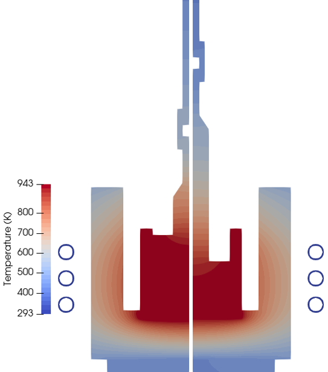
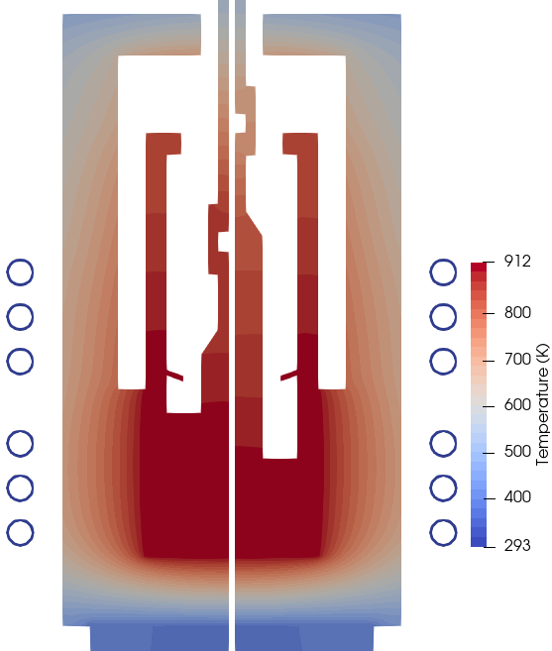
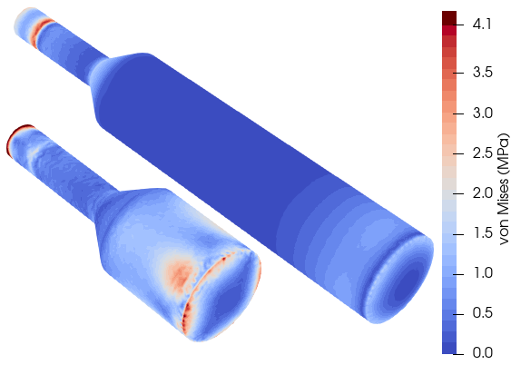

# 3D Thermal Stress Local Model

This project establishes a workflow for evaluating thermal stress in a 3D crystal geometry, based on boundary conditions extracted from an earlier 2D axisymmetric simulation.

This repository contains CsI Czochralski crystal growth cases using [Elmer](http://www.elmerfem.org/blog/).

- [CsI-reference case ](2D/Csi_reference_case): 2D simulation of CsI Czochralski growth
- [CsI-optimized case ](2D/Csi_optimum): 2D simulation of optimized CsI Czochralski growth

## Referencing

If you use this code in your research, please cite our open-access publication:

### TODO:  add link to the paper 

Further details can be found in:


## Computational setup (Docker)

The setup for the simulations is provided in form of a docker image, so just an installation of [Docker](https://docs.docker.com/get-docker/) is required on your system. The image nemocrys/opencgs:v1.0.1 is used (see [opencgs](https://github.com/nemocrys/opencgs) for more information).

On Windows, the container can be started with the following command:
```
docker run -it --rm -v ${PWD}:/home/workdir nemocrys/opencgs:v1.0.1 bash
```
On Linux, the container can be started with:
```
docker run -it --rm -v $PWD:/home/workdir -e LOCAL_UID=$(id -u $USER) -e LOCAL_GID=$(id -g $USER) nemocrys/opencgs:v1.0.1 bash
```

This will map the current working directory (e.g., a copy of this repository) into the container and, on Linux, set the user's group and user id. The simulation can then be executed using the provided `python3`.


## Workflow Overview

The simulation pipeline consists of the following steps:

1.  **2D-axisymmetric Simulation**: A 2D Electromagnetic-thermal axisymmetric simulation is performed to obtain the thermal field and phase interface. The reference case is located at `2D/Csi_reference_case`.


2.  **Thermal Boundary Extraction**: Temperature boundaries are extracted from the 2D simulation. Specifically, temperature profiles for the crystal side, top, and the crystal-melt interface are processed.

3.  **3D Geometry Generation**: A 3D mesh of the crystal is generated. The shape of the crystal bottom is determined by the extracted boundary conditions.

4.  **3D Thermal Stress Calculation**: The 3D geometry and boundary conditions are used to run a thermal stress simulation.

## Directory Structure

```
sim-cz-stress/
├── 2D/                          # 2D simulation cases
│   ├── Csi_reference_case/      # Reference case for CsI crystal
│   │   ├── geometry.py          # 2D geometry generation
│   │   ├── setup.py             # 2D simulation Elmer setup
│   │   ├── my_tools.py          # 2D utility functions
│   │   ├── post.py              # Post-processing scripts
│   │   ├── run.py               # 2D simulation runner
│   │   ├── config_geometry.yml  # 2D geometry configuration
│   │   ├── config_sim.yml       # 2D simulation parameters
│   │   ├── config_mat.yml       # 2D material properties
│   │   ├── config_elmer.yml     # 2D Elmer solver configuration
│   │   └── simdata/             # 2D simulation output
│   │       └── 01_case/         
│   │           └── results/     # Results (.dat, .vtu files)
│   └── Csi_optimum/             # Optimized case for CsI crystal (same structure as reference case)
│       └── ...                  
├── 3D/                          # 3D Thermal stress simulations
│   ├── geo_3D.py                # 3D geometry generation from 2D results
│   ├── T_boundary_from2Dto3D.py # Temperature boundary condition extraction from 2D
│   ├── setup.py                 # Elmer simulation setup
│   ├── my_tools.py              # 3D utility functions
│   ├── run.py                   # 3D simulation runner
│   ├── config_geometry.yml      # Crystal geometry configuration
│   ├── config_sim.yml           # Simulation parameters
│   ├── config_mat.yml           # Material properties
│   ├── config_elmer.yml         # Elmer solver configuration
│   └── simdata/                 # 3D simulation output directory
│       └── <case_name>/         # Results                   
├── runAll.py                    # Top-level script to run 2D + 3D workflow
└── README.md
```

## Usage

### Running Individual Simulations

1.  **Prepare 2D Results**: 
    
    First, run the 2D simulation to generate the required boundary condition files:
    ```bash
    cd 2D/Csi_reference_case
    python3 setup.py
    ```
    
    This will create the necessary `.dat` files (e.g., `crystal_T_boundary_side.dat`, `phase-if.dat`) in the `2D/Csi_reference_case/simdata/01_case/results/` directory, which are required for the 3D simulation.

2.  **Configure Simulation**:
    *   Navigate to the `3D/` directory.
    *   Edit `run.py` to select the desired simulation case from the `simulations` list.
    *   Adjust `config_geometry.yml`, `config_sim.yml`, and `config_mat.yml` as needed.

3.  **Run the 3D Simulation**:
    Execute the 3D simulation script:
    ```bash
    cd 3D
    python3 run.py
    ```

    This script will:
    *   Create a directory for the simulation in `3D/simdata/`.
    *   Generate the 3D crystal mesh (`mesh.msh`).
    *   Create the temperature boundary condition files from 2D simulation.
    *   Generate the Elmer simulation files (`case.sif`, etc.).
    *   Run `ElmerGrid` to convert the mesh.
    *   Run `ElmerSolver` to perform the simulation.

### Running the Complete Workflow

To run both the 2D and 3D simulations sequentially, use the top-level script:

```bash
python3 runAll.py
```

This will:
1. Execute the 2D simulation in `2D/<case_name>/`
2. Execute the 3D simulation in `3D/` using the 2D results

## Output

The simulation results are stored in the following locations:

**2D Simulation Results:**
- Location: `2D/<case_name>/simdata/01_case/results/`
- Files: Temperature and field data (`.dat` files), ParaView visualization files (`.vtu`) and `phase-if.dat`, `crystal_T_boundary_side.dat`, `crystal_T_boundary_top.dat`

**3D Simulation Results:**
- Location: `3D/simdata/<case_name>/`
- Files: ParaView visualization files (`.vtu`) regarding thermal stress calculation.

You can visualize both 2D and 3D results using [ParaView](https://www.paraview.org/).

## Results


<!-- Row 1 -->
<div style="text-align: center;">
  <p float="left">
    
    
  </p>
  <em>Figure 1: 2D temperature fields for 60 mm and the entire crystal (117 mm). Reference case (left) and optimized case (right).</em>
</div>

<!-- Row 2 -->
<div style="text-align: center; margin-top: 20px;">
  <p float="left">
    
    
  </p>
  <em>Figure 2: 3D thermal stress fields for 60 mm and the entire crystal (117 mm). Reference case (left) and optimized case (right).</em>
</div>


## Acknowledgements

[This project](https://nemocrys.github.io/) has received funding from the European Research Council (ERC) under the European Union's Horizon 2020 research and innovation programme (grant agreement No 851768).


