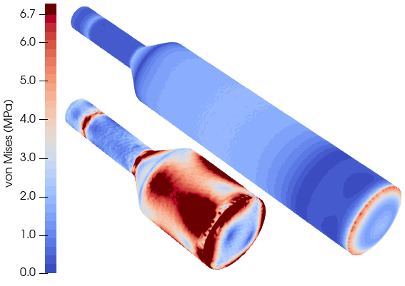

# 3D Thermal Stress Local Model

This project implements a workflow for calculating thermal stress in a 3D crystal geometry, using boundary conditions derived from a preceding 2D-axisymmetric simulation.


# CODE TODOs

```
sim-cz-stress/
├── cz_stress_3d/
│   ├── __init__.py
│   ├── geometry.py            # Refactored from geo_3D.py
│   ├── boundary_conditions.py #-//- T_boundary_from2Dto3D.py
│   ├── simulation.py          # -//- setup.py 
│   └── utils.py               # -//- my_tools.py
├── run.py                      #  Top-Level Execution Script

```
## Referencing

If you use this code in your research, please cite our open-access publication:

### TODO:  add link to my paper 

Further details can be found in:

### TODO: add links for opecgs and arveds papers

## Prerequisites

The following Python packages are required:

### TODO: Add docker container instructions and links to for pyelmer and objectgmsh

*   `numpy`
*   `pandas`
*   `pyyaml`
*   `gmsh`
*   `pyelmer` (Custom wrapper for ElmerFEM)
*   `objectgmsh` (Custom wrapper for Gmsh)


## Repo overview

### TODO: Mention the 4 major cases CsI, CsI optimized, Ga2O3 and Al2O3 


## Workflow Overview

The simulation pipeline consists of the following steps:

1.  **2D-axisymmetric Simulation**: A 2D Electromagnetic-thermal axisymmetric simulation is performed to obtain the thermal field and phase interface. The reference case is located at `2D/2D_Csi_reference_case`.


2.  **Thermal Boundary Extraction**: Temperature boundaries are extracted from the 2D simulation. Specifically, temperature profiles for the crystal side, top, and the crystal-melt interface are processed.

3.  **3D Geometry Generation**: A 3D mesh of the crystal is generated using Gmsh. The shape of the crystal bottom is determined by the extracted boundary conditions.

4.  **3D Thermal Stress Calculation**: The 3D geometry and boundary conditions are used to run a thermal stress simulation using ElmerFEM.

## Directory Structure

### TODO: Update this section and clean yaml files

*   `run.py`: The main execution script. It orchestrates the geometry generation, boundary condition extraction, and the Elmer simulation.
*   `geo_3D.py`: Handles the generation of the 3D geometry using Gmsh.
*   `T_boundary_from2Dto3D.py`: Extracts and formats temperature boundary conditions from the 2D simulation data for use in the 3D simulation.
*   `config_geometry.yml`: Configuration for the crystal geometry (lengths, diameters, mesh size).
*   `config_sim.yml`: Configuration for the simulation parameters (e.g., solver settings).
*   `config_mat.yml`: Material properties configuration.
*   `2D/`: Directory containing the results of the 2D simulations.
*   `simdata/`: Output directory where 3D simulation results and meshes are stored.

## Usage

### TODO: Update this section for new code

1.  **Prepare 2D Results**: Ensure that the 2D simulation results are present in the `2D/` directory. The scripts expect specific `.dat` files (e.g., `crystal_T_boundary_side.dat`, `phase-if.dat`).

2.  **Configure Simulation**:
    *   Edit `run.py` to select the desired simulation case from the `simulations` list.
    *   Adjust `config_geometry.yml`, `config_sim.yml`, and `config_mat.yml` as needed.

3.  **Run the Simulation**:
    Execute the main script:
    ```bash
    python run.py
    ```

    This script will:
    *   Create a directory for the simulation in `simdata/`.
    *   Generate the 3D crystal mesh (`mesh.msh`).
    *   Create the temperature boundary condition files from 2D simulation.
    *   Generate the Elmer simulation files (`case.sif`, etc.).
    *   Run `ElmerGrid` to convert the mesh.
    *   Run `ElmerSolver` to perform the simulation.

## Output

The results of the 3D simulation are stored in the `simdata/<simulation_name>` directory. You can visualize the results (e.g., `.vtu` files) using ParaView.

## Results

### TODO: Add explanation text and link the images to the Usage section.





## Acknowledgements

[This project](https://nemocrys.github.io/) has received funding from the European Research Council (ERC) under the European Union's Horizon 2020 research and innovation programme (grant agreement No 851768).


